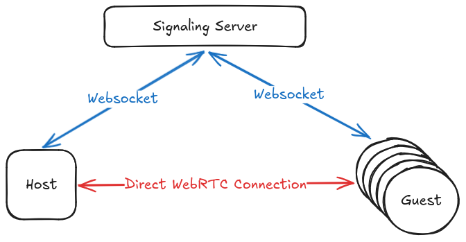

## Introduction

A command-line tool that enables users to securely forward local ports over the internet using WebRTC. Leveraging the Pion Golang library, this tool supports both TCP and UDP protocols in a multiplexed, encrypted, and concurrent connection. 

## Example use cases

- **Remote Development:** Share your local development server with team members without exposing your network.
- **Game Hosting:** Host a local game server and forward the port to allow friends to join remotely.
- **Secure Access:** Access internal resources securely over the internet.

## Architecture



## Usage

### Create a party and forward ports
```sh
$ pleer -host -tcp 8080 -tcp 25565
```

After executing this command, the CLI will provide you with a `PARTY_ID`. You need to share this `PARTY_ID` with any peer who wants to join the party.

### Join a party
```sh
$ pleer -join {PARTY_ID}
```

Once you successfully join a party, you will automatically be able to exchange data over the ports defined by the host. For the connection to happen, you must have the signaling server.

## Signaling Server

The signaling server is required for establishing a WebRTC connection between peers. You can run the signaling server using:

```bash
$ go run ./signal
```

## Roadmap

- **Desktop Application:** Develop a GUI-based desktop application for ease of use.
- **Enhanced UDP Support:** Improve UDP handling for better performance in real-time applications.
- **Stability Improvements:** Address edge cases and ensure robust connection handling.
